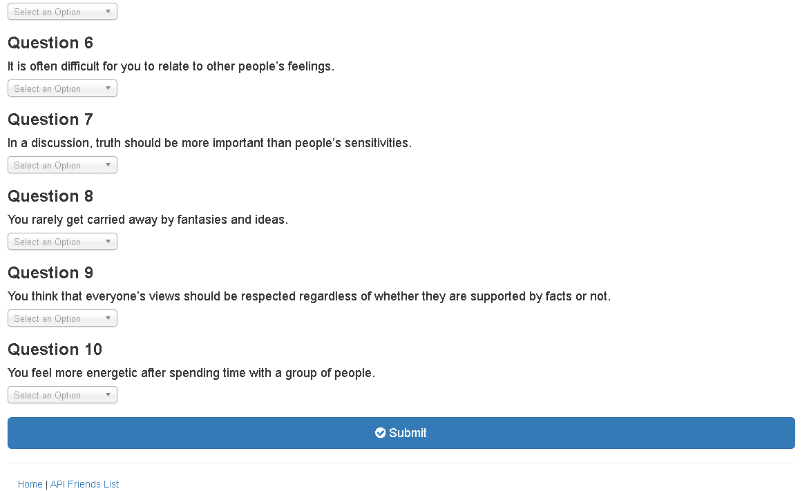

# FriendFinder
 
#### A Full-Stack Online Application to find like-minded friends.

### Overview

This application is a compatibility-based "FriendFinder" application.  This full-stack site will take in results from a users' surveys, then compare their answers with those from other users. The application will then display the information of the user with the best overall match.

### Technologies Used

Node.js, Express.js, JavaScript, JQuery, and Heroku

### Packages Required:

Minimalist web framework for node.
[express](https://www.npmjs.com/package/express)

### Installation

In order to run this application locally you will need to install the following npm packages (as referenced above):

* npm install express

### Usage

   * Go to the application on [Heroku](https://limitless-wildwood-91948.herokuapp.com/)
   * Click blue "Go to Survey" button
   * Fill out and submit the survey.  Once submitted your most compatible friend will be displayed.
   * Click "API Friends List" link to see JSON of saved friends.